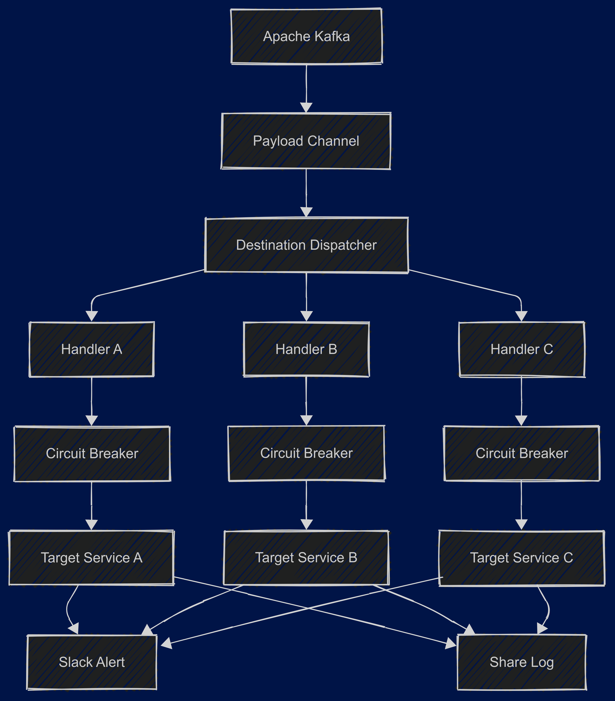

# ShareWorker

분산 환경에서의 데이터 처리 및 공유를 위한 워커 시스템

## 시스템 개요
- 대용량 데이터의 분산 처리
- Kafka Streams를 활용한 실시간 데이터 조인
- 코루틴 기반의 비동기 처리

## 아키텍처

### 주요 컴포넌트
1. **Share Worker**
   - 데이터 분배 및 처리
   - 워커 상태 관리
   - 페이로드 검증

2. **Stream Handler**
   - KTable/KStream 기반 데이터 조인
   - 실시간 데이터 처리
   - 자동 클린업

3. **Payload Channel**
   - 비동기 메시지 전달
   - 백프레셔 처리

## 기술 스택
- Kotlin 1.8.x
- Spring Boot 3.x
- Apache Kafka
- MongoDB
- Coroutines

## 예상 병목 포인트 및 해결 방안
1. **데이터 조인 처리**
   - 문제: KTable 데이터 증가에 따른 메모리 부하
   - 해결: 주기적 클린업, 파티셔닝 전략

2. **메시지 처리 지연**
   - 문제: 대량 메시지 유입 시 처리 지연
   - 해결: 백프레셔 구현, 스케일아웃 전략

## 확장성 고려사항
- 수평적 확장 가능한 구조
- 컨테이너화 지원
- 설정의 외부화
